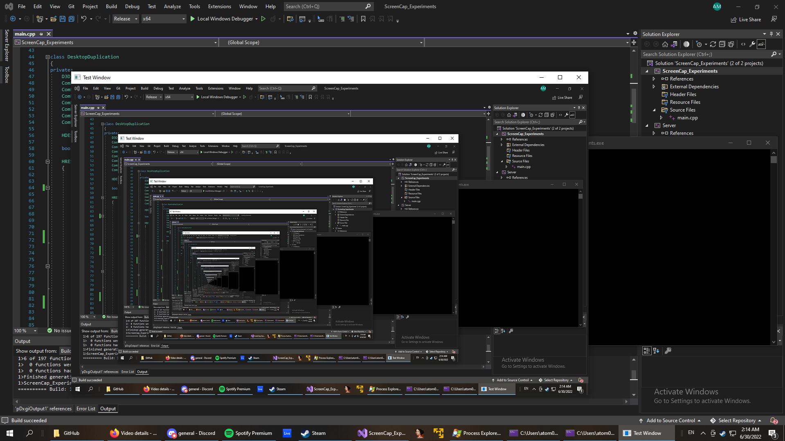

# ScreenCap_Experiments

An experiment to record the Windows desktop utilizing the hardware-accelerated Desktop Duplication APIs.

## How to use

First run the server project, then run the main ScreenCap_Experiments project.
Frames are transmitted over TCP from the ScreenCap client to the server.

## Features

* Hardware-accelerated desktop recording
* Double-buffered rendering
* Frame Compression
* Thread-safe mutex locking